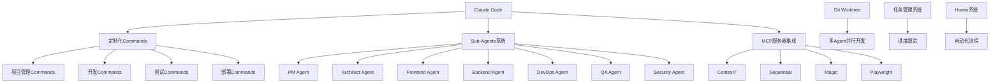
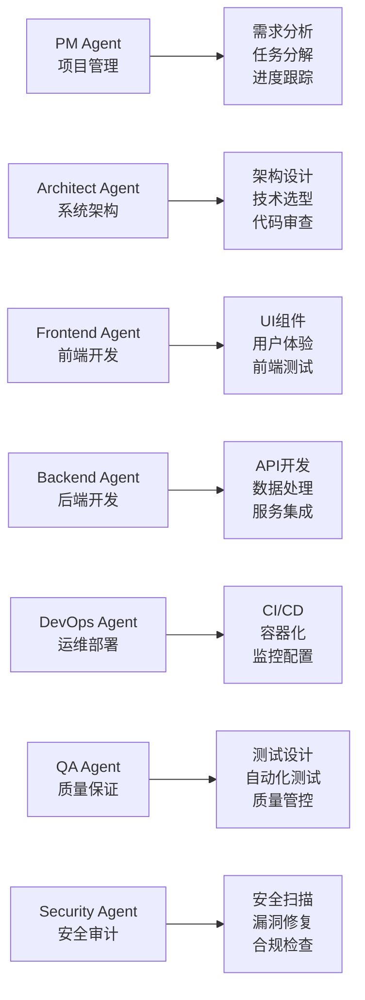
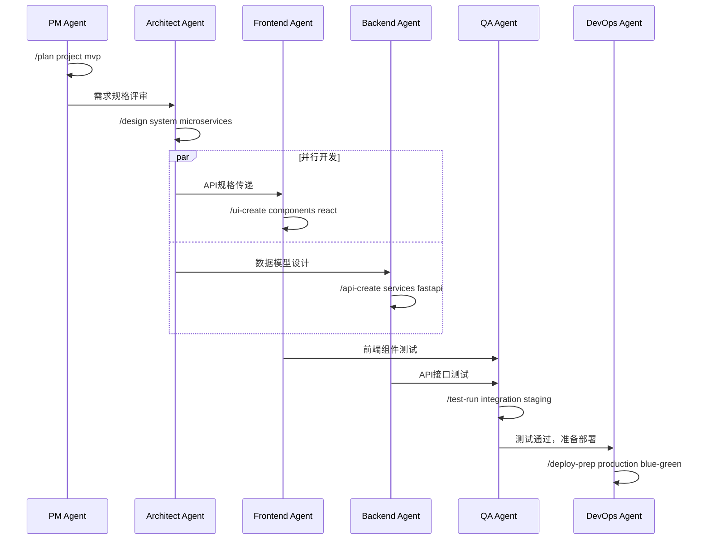

# Claude Code 定制化研发流程模板

> **基于Spec-Driven和Test-Driven开发的全流程AI辅助研发系统**

[](https://opensource.org/licenses/MIT)
[](https://claude.ai/code)
[](https://github.com/your-org/template-agenticide-vibecoding)

## 🎯 项目概述

本项目提供了一套完整的定制化研发流程模板，专为Claude Code环境设计，支持从需求分析到系统监控的全生命周期开发。通过多Agent角色协作、智能工作流和自动化工具链，实现高效的软件开发流程。

### 核心特性

- 🤖 **多Agent角色系统**: PM、架构师、前端、后端、运维、QA等7个专业角色
- 📋 **Spec-Driven开发**: 规格驱动的开发模式，确保需求和实现一致性  
- 🧪 **Test-Driven开发**: 测试驱动开发，保证代码质量和可靠性
- 🔄 **持续集成**: 自动化CI/CD流水线和质量门禁
- 🌿 **并行开发**: Git Worktree支持多Agent并行开发
- 📊 **进度跟踪**: 实时项目进度跟踪和Markdown状态管理
- 🛠️ **工具集成**: MCP服务器、开发工具链完整集成

### 适用场景

- **中大型软件项目**: 需要多角色协作的复杂项目
- **敏捷开发团队**: 追求高效迭代和持续交付的团队
- **质量要求高**: 对代码质量和系统稳定性要求严格的项目
- **AI辅助开发**: 希望充分利用AI能力提升开发效率的团队

## 🏗️ 架构设计

### 系统架构图



### Agent角色架构



## 🚀 快速开始

### 环境要求

- **Claude Code**: 已安装并配置Claude Code环境
- **Git**: 版本 >= 2.30
- **Node.js**: 版本 >= 18.0 (前端开发)
- **Python**: 版本 >= 3.8 (后端开发)
- **Docker**: 最新版本 (容器化部署)

### 安装步骤

1. **克隆模板仓库**
   ```bash
   git clone https://github.com/your-org/template-agenticide-vibecoding.git
   cd template-agenticide-vibecoding
   ```

2. **初始化项目配置**
   ```bash
   # 复制配置文件到Claude Code配置目录
   cp CLAUDE.md ~/.claude/CLAUDE.md
   
   # 初始化Git Worktree环境
   ./scripts/git-worktree-manager.sh init
   ```

3. **配置MCP服务器**
   ```bash
   # 安装必要的MCP服务器
   # Context7, Sequential, Magic, Playwright
   # 具体安装方法参考 config/mcp-servers.yaml
   ```

4. **验证安装**
   ```bash
   # 检查Claude Code配置
   claude-code --version
   
   # 检查工作空间状态
   ./scripts/git-worktree-manager.sh status
   ```

### 第一个项目

1. **创建新项目**
   ```bash
   # 使用PM Agent创建项目规划
   /plan my-awesome-project mvp
   ```

2. **设置Agent工作空间**
   ```bash
   # 为前端Agent创建工作空间
   ./scripts/git-worktree-manager.sh create-workspace frontend user-interface
   
   # 为后端Agent创建工作空间  
   ./scripts/git-worktree-manager.sh create-workspace backend api-server
   ```

3. **开始开发**
   ```bash
   # 切换到前端工作空间
   cd workspace/frontend/user-interface
   
   # 使用定制化命令开发
   /ui-create login-form react
   /test-gen component 90%
   ```

## 📚 详细文档

### 核心配置文件

| 文件 | 描述 | 用途 |
|------|------|------|
| `CLAUDE.md` | 主配置文件 | 定义研发流程和Agent角色 |
| `config/commands.yaml` | 命令配置 | 定制化Commands和参数 |
| `config/hooks.yaml` | Hooks配置 | 自动化触发器和动作 |
| `config/mcp-servers.yaml` | MCP配置 | 服务器集成和工具链 |
| `config/task-management.yaml` | 任务管理 | 任务状态和流程定义 |
| `config/git-workflow.yaml` | Git工作流 | 分支策略和协作规范 |

### Agent角色详细说明

#### PM Agent (项目管理专家)
- **职责**: 项目规划、任务分解、进度跟踪、风险管理
- **主要命令**: `/plan`, `/track`, `/review`, `/estimate`
- **文档**: [agents/pm-agent.md](agents/pm-agent.md)

#### Architect Agent (架构师专家)  
- **职责**: 系统设计、技术选型、代码审查、架构治理
- **主要命令**: `/design`, `/analyze`, `/review-arch`, `/refactor`
- **文档**: [agents/architect-agent.md](agents/architect-agent.md)

#### Frontend Agent (前端开发专家)
- **职责**: UI开发、用户体验、前端性能、组件设计
- **主要命令**: `/ui-create`, `/component-gen`, `/optimize-fe`, `/test-ui`
- **文档**: [agents/frontend-agent.md](agents/frontend-agent.md)

#### Backend Agent (后端开发专家)
- **职责**: API开发、数据处理、服务集成、后端性能
- **主要命令**: `/api-create`, `/db-design`, `/optimize-be`, `/test-api`
- **文档**: [agents/backend-agent.md](agents/backend-agent.md)

#### DevOps Agent (运维开发专家)
- **职责**: CI/CD、容器化、监控、自动化运维
- **主要命令**: `/deploy`, `/monitor`, `/pipeline`, `/infra`
- **文档**: [agents/devops-agent.md](agents/devops-agent.md)

#### QA Agent (质量保证专家)
- **职责**: 测试策略、自动化测试、质量管控、缺陷管理
- **主要命令**: `/test-create`, `/test-run`, `/bug-track`, `/quality-report`
- **文档**: [agents/qa-agent.md](agents/qa-agent.md)

#### Security Agent (安全专家)
- **职责**: 安全扫描、漏洞修复、合规检查、安全加固
- **主要命令**: `/security-scan`, `/audit`, `/permission-design`
- **文档**: [agents/security-agent.md](agents/security-agent.md)

## 🛠️ 定制化Commands

### 项目管理类Commands

#### `/spec-create [domain] [type]`
创建技术规格文档
```bash
/spec-create frontend component-library --template --detail
/spec-create backend api-gateway --review
```

#### `/prd-gen [feature] [priority]`
生成产品需求文档
```bash
/prd-gen user-auth high --stakeholders --metrics
/prd-gen payment-system critical --timeline
```

#### `/task-break [feature] [granularity]`
任务分解与估算
```bash
/task-break payment-system detailed --dependencies --risks
/task-break user-dashboard moderate --parallel
```

### 开发类Commands

#### `/implement [feature]`
实现功能或组件
```bash
/implement user-login --type component --framework react --test-driven
/implement payment-api --type api --framework fastapi --spec-driven
```

#### `/code-review [scope]`
代码审查与质量检查
```bash
/code-review src/auth --focus security --automated
/code-review . --focus all --checklist
```

### 测试类Commands

#### `/test-gen [type] [coverage]`
生成测试用例和脚本
```bash
/test-gen e2e 90% --framework playwright --data
/test-gen unit 80% --framework jest --parallel
```

#### `/test-run [suite] [environment]`
执行测试套件
```bash
/test-run regression staging --parallel --report
/test-run smoke production --coverage
```

### 部署类Commands

#### `/deploy-prep [env] [strategy]`
部署准备与配置
```bash
/deploy-prep production blue-green --validate --rollback
/deploy-prep staging rolling --monitor
```

#### `/monitor-setup [service] [metrics]`
监控系统配置
```bash
/monitor-setup payment-api performance --alerts --dashboard
/monitor-setup user-service availability --sla
```

## 🔄 工作流程

### Spec-Driven开发流程

```mermaid
graph TD
    A[需求收集] --> B[创建PRD]
    B --> C[技术规格设计]
    C --> D[API设计评审]
    D --> E[开发实现]
    E --> F[规格验证]
    F --> G[集成测试]
    G --> H[部署发布]
    
    B --> I[/prd-gen]
    C --> J[/spec-create]
    E --> K[/implement --spec-driven]
    F --> L[/code-review]
    G --> M[/test-run]
    H --> N[/deploy-prep]
```

### Test-Driven开发流程

```mermaid
graph TD
    A[编写测试] --> B[运行测试失败]
    B --> C[编写代码]
    C --> D[运行测试通过]
    D --> E[重构代码]
    E --> F[运行测试通过]
    F --> G[提交代码]
    
    A --> H[/test-gen]
    B --> I[/test-run]
    C --> J[/implement --test-driven]
    D --> K[/test-run]
    E --> L[/refactor]
    G --> M[/code-review]
```

### 多Agent协作流程



## 🌿 Git Worktree多Agent并行开发

### 工作空间管理

```bash
# 查看所有Agent工作空间
./scripts/git-worktree-manager.sh list-workspaces

# 创建Agent任务工作空间
./scripts/git-worktree-manager.sh create-workspace <agent> <task>

# 同步工作空间
./scripts/git-worktree-manager.sh sync-workspace <agent>

# 合并工作空间到主分支
./scripts/git-worktree-manager.sh merge-workspace <agent> develop

# 清理工作空间
./scripts/git-worktree-manager.sh cleanup-workspace <agent> <task>
```

### 分支策略

- **主分支**: `main` - 生产发布分支
- **开发分支**: `develop` - 集成开发分支  
- **功能分支**: `feature/{agent}/{task-name}` - Agent任务分支
- **热修复分支**: `hotfix/{issue-id}-{description}` - 紧急修复分支

### 并行开发示例

```bash
# PM Agent规划项目
./scripts/git-worktree-manager.sh create-workspace pm project-planning
cd workspace/pm/project-planning
/plan e-commerce-platform mvp

# 架构师设计系统
./scripts/git-worktree-manager.sh create-workspace architect system-design  
cd workspace/architect/system-design
/design payment-system microservices

# 前端开发用户界面
./scripts/git-worktree-manager.sh create-workspace frontend user-interface
cd workspace/frontend/user-interface  
/ui-create product-catalog react

# 后端开发API服务
./scripts/git-worktree-manager.sh create-workspace backend api-services
cd workspace/backend/api-services
/api-create product-api fastapi
```

## 📊 任务管理与进度跟踪

### 任务状态管理

| 状态 | 描述 | 图标 | 可转换状态 |
|------|------|------|------------|
| backlog | 需求池中的待规划任务 | 📋 | planned, cancelled |
| planned | 已规划，待执行的任务 | 📅 | in-progress, blocked |
| in-progress | 正在执行中的任务 | 🔄 | review, testing, blocked |
| review | 代码审查中的任务 | 👁️ | in-progress, testing, done |
| testing | 测试验证中的任务 | 🧪 | in-progress, review, done |
| blocked | 被阻塞的任务 | 🚧 | planned, in-progress |
| done | 已完成的任务 | ✅ | testing |
| cancelled | 已取消的任务 | ❌ | 终态 |

### 进度文件管理

项目进度保存在 `PROJECT_PROGRESS.md` 文件中，支持：

- ✅ **实时更新**: 任务状态变更时自动更新
- 📊 **进度可视化**: 进度条和图表展示
- 🎯 **里程碑跟踪**: 关键节点和交付物管理
- ⚠️ **风险预警**: 风险识别和应对措施
- 👥 **团队协作**: Agent工作负载和协作状态

### 使用示例

```bash
# 查看项目进度
cat PROJECT_PROGRESS.md

# 更新任务状态
/progress-sync --daily

# 生成里程碑报告  
/progress-sync --milestone
```

## 🔧 MCP服务器集成

### Context7 (文档与最佳实践)
- **用途**: 技术文档查询、最佳实践参考、代码模式验证
- **自动激活**: 外部库导入、框架问题、文档请求
- **工作流集成**: `/spec-create`, `/implement`, `/code-review`

### Sequential (复杂分析与推理)  
- **用途**: 多步骤问题解决、架构分析、系统调试
- **自动激活**: 复杂调试场景、系统设计、多步骤分析
- **工作流集成**: `/task-break`, `/analyze`, `/troubleshoot`

### Magic (UI组件生成)
- **用途**: 现代UI组件生成、设计系统集成、响应式设计
- **自动激活**: UI组件请求、设计系统查询、前端开发
- **工作流集成**: `/ui-create`, `/component-gen`, `/implement`

### Playwright (浏览器自动化)
- **用途**: 跨浏览器E2E测试、性能监控、UI自动化
- **自动激活**: 测试工作流、性能监控、E2E测试生成
- **工作流集成**: `/test-gen`, `/test-run`, `/monitor-setup`

## ⚙️ 配置定制

### 自定义Agent角色

1. **创建Agent配置文件**
   ```yaml
   # agents/custom-agent.md
   role: "Custom Agent"
   responsibilities: [...]
   tools: [...]
   commands: [...]
   ```

2. **更新CLAUDE.md**
   ```markdown
   ### Custom Agent
   - 职责描述
   - 工具配置  
   - 命令定义
   ```

### 添加定制Commands

1. **编辑commands.yaml**
   ```yaml
   /custom-command:
     description: "自定义命令描述"
     usage: "/custom-command [参数]"
     category: "custom"
     agent: "Custom Agent"
   ```

2. **实现命令逻辑**
   ```bash
   # 在相应Agent配置中添加命令实现
   ```

### 配置工具链集成

1. **更新toolchain.yaml**
   ```yaml
   custom_tools:
     my_tool:
       enabled: true
       config: {...}
   ```

2. **配置MCP服务器**
   ```yaml
   # mcp-servers.yaml
   custom_server:
     enabled: true
     endpoint: "custom://server"
   ```

## 🔍 故障排除

### 常见问题

#### Q: Claude Code无法识别定制Commands？
A: 检查CLAUDE.md文件是否正确放置在Claude配置目录，确保文件格式正确。

#### Q: Git Worktree创建失败？
A: 确保：
- 当前目录是Git仓库
- 有足够的磁盘空间
- Git版本 >= 2.30
- 运行初始化命令：`./scripts/git-worktree-manager.sh init`

#### Q: MCP服务器连接失败？
A: 检查：
- MCP服务器是否正确安装和启动
- 网络连接是否正常
- 配置文件中的端点地址是否正确

#### Q: Agent工作空间冲突？
A: 使用以下命令解决：
```bash
# 清理冲突的工作空间
./scripts/git-worktree-manager.sh cleanup-workspace <agent> <task>

# 重新创建工作空间
./scripts/git-worktree-manager.sh create-workspace <agent> <task>
```

### 调试模式

```bash
# 启用详细日志
export CLAUDE_DEBUG=true

# 检查系统状态
./scripts/git-worktree-manager.sh status

# 验证配置文件
./scripts/validate-config.sh
```

## 📈 性能优化

### Git优化配置
```bash
git config core.preloadindex true
git config core.fscache true  
git config gc.auto 256
```

### 大文件处理
```bash
# 启用Git LFS
git lfs install
git lfs track "*.zip" "*.tar.gz" "*.dmg"
```

### 缓存策略
- **MCP服务器缓存**: 1小时TTL
- **任务状态缓存**: 5分钟TTL  
- **构建缓存**: 自动管理

## 🤝 贡献指南

### 贡献流程

1. **Fork仓库**
2. **创建功能分支**: `git checkout -b feature/amazing-feature`
3. **提交更改**: `git commit -m 'Add amazing feature'`
4. **推送分支**: `git push origin feature/amazing-feature`
5. **创建Pull Request**

### 代码规范

- **提交信息**: 使用[Conventional Commits](https://conventionalcommits.org/)格式
- **代码风格**: 遵循项目现有代码风格
- **文档**: 更新相关文档和README
- **测试**: 添加必要的测试用例

### 贡献领域

- 🐛 **Bug修复**: 报告和修复问题
- ✨ **新功能**: 添加新的Agent角色或Commands
- 📚 **文档**: 改进文档和使用指南
- 🔧 **工具集成**: 集成新的开发工具
- 🚀 **性能优化**: 提升系统性能

## 📄 许可证

本项目采用 [MIT许可证](LICENSE)。

## 🙏 致谢

感谢以下项目和社区的支持：

- [Claude Code](https://claude.ai/code) - AI辅助编程平台
- [Git Worktree](https://git-scm.com/docs/git-worktree) - Git并行开发支持
- [MCP Protocol](https://modelcontextprotocol.io/) - 模型上下文协议
- [Playwright](https://playwright.dev/) - 现代web测试框架

## 📞 支持与联系

- **问题报告**: [GitHub Issues](https://github.com/your-org/template-agenticide-vibecoding/issues)
- **功能请求**: [GitHub Discussions](https://github.com/your-org/template-agenticide-vibecoding/discussions)
- **文档网站**: [项目文档](https://your-org.github.io/template-agenticide-vibecoding)
- **社区交流**: [Discord服务器](https://discord.gg/your-channel)

---

<div align="center">

**🚀 让AI助力您的软件开发之旅！**

[开始使用](https://github.com/your-org/template-agenticide-vibecoding/blob/main/docs/getting-started.md) | [API文档](https://your-org.github.io/template-agenticide-vibecoding/api) | [示例项目](https://github.com/your-org/template-agenticide-vibecoding/tree/main/examples)

</div>