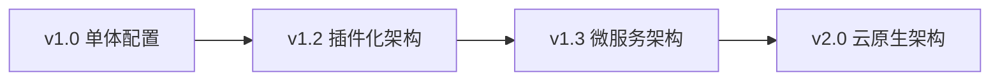
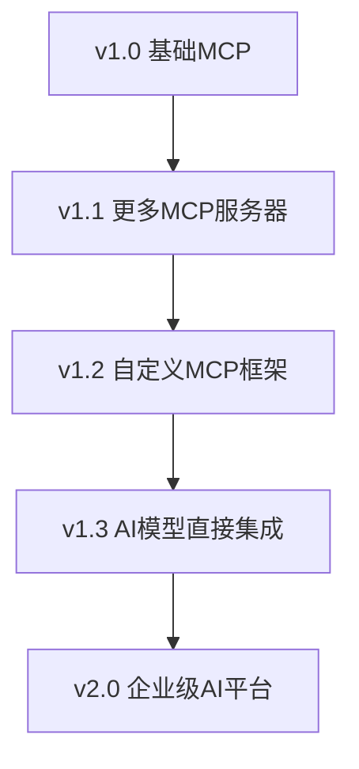

# Claude Code 定制化研发流程系统 - 产品路线图

> **项目愿景**: 构建最先进的AI辅助软件开发流程，让开发者和团队能够高效、高质量地构建软件产品

## 🎯 产品愿景与目标

### 长期愿景 (2025年)
成为AI辅助软件开发的标准化流程模板，被广泛应用于各种规模的软件开发项目，显著提升开发效率和产品质量。

### 核心目标
1. **开发效率提升**: 相比传统开发流程提升50%+的开发效率
2. **质量保证**: 实现95%+的代码质量分数和80%+的测试覆盖率
3. **流程标准化**: 建立可复制、可扩展的标准化开发流程
4. **AI能力最大化**: 充分发挥Claude Code和MCP生态的AI能力

## 📅 版本发布计划

### ✅ v1.0.0 - 初始版本 (2025-01-02)
**状态**: 已发布  
**主题**: 基础框架和核心功能

#### 核心特性
- 7个专业Agent角色完整定义
- 20+定制化Commands覆盖全开发流程
- 4个MCP服务器集成（Context7、Sequential、Magic、Playwright）
- Git Worktree多Agent并行开发支持
- 完整的任务管理和进度跟踪系统
- 25+自动化Hooks覆盖开发生命周期

#### 技术成果
- 📂 20个核心文件，13,000+行配置代码
- 📚 完整文档体系和使用指南
- 🔧 Git Worktree管理脚本
- 📊 项目进度跟踪模板

---

### 🚀 v1.1.0 - 用户体验优化 (2025-01-15)
**状态**: 计划中  
**主题**: 易用性和用户体验提升

#### 计划功能
- **🎨 可视化配置界面**
  - Web界面配置Agent角色和Commands
  - 拖拽式工作流设计器
  - 实时预览和配置验证

- **📦 一键安装脚本**
  - 自动化环境检测和依赖安装
  - 配置向导引导用户完成初始设置
  - 预设的项目模板选择

- **🔍 智能诊断工具**
  - 配置问题自动检测和修复建议
  - 性能瓶颈分析和优化建议
  - 使用模式分析和改进推荐

#### 改进重点
- 降低新用户上手难度
- 提供更多开箱即用的配置选项
- 增强错误提示和帮助信息

---

### 🎯 v1.2.0 - 高级集成和扩展 (2025-02-01)
**状态**: 计划中  
**主题**: 高级功能和生态集成

#### 计划功能
- **🔌 更多MCP服务器支持**
  - GitHub Copilot集成
  - Azure OpenAI服务集成
  - 自定义MCP服务器开发框架

- **📊 高级分析和报告**
  - 开发效率分析仪表盘
  - 代码质量趋势分析
  - 团队协作效率报告
  - AI辅助决策建议

- **🎭 角色扩展系统**
  - 可插拔的Agent角色架构
  - 自定义Agent角色创建工具
  - 角色市场和分享平台

- **🌐 多平台集成**
  - VS Code扩展
  - JetBrains IDE插件
  - GitHub Actions集成
  - Slack/Teams通知集成

#### 技术改进
- 插件化架构重构
- 性能优化和资源管理
- 分布式工作空间支持

---

### 🚀 v1.3.0 - 智能化和自动化 (2025-03-01)
**状态**: 计划中  
**主题**: AI智能化和深度自动化

#### 计划功能
- **🧠 智能工作流推荐**
  - 基于项目特征的工作流自动生成
  - 最佳实践智能推荐
  - 个性化配置学习和优化

- **🤖 自动化代码生成**
  - 基于规格的自动化代码生成
  - 测试用例智能生成
  - 文档自动更新和同步

- **📈 预测性分析**
  - 项目风险预测和预警
  - 交付时间智能预估
  - 资源需求预测

- **🔄 持续学习系统**
  - 从项目历史中学习最佳实践
  - 错误模式识别和预防
  - 效率优化建议生成

#### AI能力增强
- 更深度的Claude Code集成
- 机器学习模型训练和优化
- 自然语言处理能力增强

---

### 🌟 v2.0.0 - 企业级和云原生 (2025-06-01)
**状态**: 规划中  
**主题**: 企业级功能和云原生架构

#### 计划功能
- **☁️ 云原生架构**
  - 微服务化Agent架构
  - 容器化部署和管理
  - 弹性扩展和负载均衡

- **👥 企业级协作**
  - 大规模团队协作支持
  - 权限管理和访问控制
  - 企业级安全和合规

- **📊 企业级分析**
  - 多项目统一管理
  - 企业级报告和BI集成
  - ROI分析和效益评估

- **🔐 安全和合规**
  - 端到端安全加密
  - 审计日志和合规报告
  - 数据隐私保护

#### 企业特性
- SSO和企业认证集成
- 私有化部署支持
- 企业级SLA保证

---

## 🎭 Agent角色发展路线图

### 当前Agent (v1.0.0)
- PM Agent - 项目管理专家
- Architect Agent - 系统架构专家
- Frontend Agent - 前端开发专家
- Backend Agent - 后端开发专家
- DevOps Agent - 运维开发专家
- QA Agent - 质量保证专家
- Security Agent - 安全专家

### 计划新增Agent

#### v1.2.0 新增
- **Data Agent** - 数据科学和分析专家
- **Mobile Agent** - 移动端开发专家
- **Business Agent** - 业务分析专家

#### v1.3.0 新增
- **AI/ML Agent** - 人工智能和机器学习专家
- **Performance Agent** - 性能优化专家
- **Legal Agent** - 法务合规专家

#### v2.0.0 新增
- **Product Agent** - 产品管理专家
- **Marketing Agent** - 市场营销专家
- **Support Agent** - 技术支持专家

## 🔧 技术发展路线图

### 架构演进

### 集成能力扩展

## 📊 成功指标和里程碑

### 用户增长目标
- v1.1.0: 100+ 早期用户
- v1.2.0: 500+ 活跃用户
- v1.3.0: 1,000+ 用户，10+ 企业客户
- v2.0.0: 5,000+ 用户，100+ 企业客户

### 质量指标目标
- 代码质量分数: 95%+
- 测试覆盖率: 90%+
- 文档完整性: 95%+
- 用户满意度: 4.5+/5.0

### 性能指标目标
- 开发效率提升: 50%+
- 错误率降低: 70%+
- 部署频率提升: 300%+
- 平均修复时间缩短: 60%+

## 🤝 社区和生态发展

### 开源社区建设
- **GitHub组织**: 建立官方GitHub组织
- **贡献者指南**: 完善贡献流程和文档
- **社区活动**: 定期技术分享和使用案例展示
- **认证计划**: Agent配置师认证计划

### 生态合作伙伴
- **工具集成商**: 与主流开发工具建立合作
- **云服务商**: 与AWS、Azure、GCP等云平台集成
- **企业客户**: 与企业客户共建解决方案
- **教育机构**: 与高校合作推广AI辅助开发教育

### 知识共享平台
- **最佳实践库**: 收集和分享成功案例
- **模板市场**: 行业特定的配置模板
- **培训课程**: 在线培训和认证课程
- **技术博客**: 定期发布技术文章和教程

## 🔮 长期愿景 (2025年底)

### 技术愿景
- 成为AI辅助软件开发的事实标准
- 构建完整的AI开发工具生态系统
- 实现真正的AI-Human协作开发模式

### 商业愿景
- 建立可持续的商业模式
- 形成强大的合作伙伴网络
- 创造显著的行业价值

### 社会愿景
- 降低软件开发门槛，让更多人能够参与软件创造
- 提升全行业的软件质量和开发效率
- 推动AI技术在软件开发领域的普及应用

---

## 📝 版本发布流程

### 发布周期
- **Major版本** (x.0.0): 每6个月，包含重大功能更新
- **Minor版本** (x.y.0): 每月，包含新功能和改进
- **Patch版本** (x.y.z): 每周，包含缺陷修复和小改进

### 发布质量标准
- 所有自动化测试通过
- 代码审查100%覆盖
- 文档更新完整
- 向后兼容性保证

### Beta测试计划
- 内部测试: 1周
- 社区Beta测试: 2周
- 发布候选版本: 1周

---

*此路线图将根据用户反馈、技术发展和市场需求定期更新调整*

**最后更新**: 2025-01-02  
**下次更新**: 2025-01-15